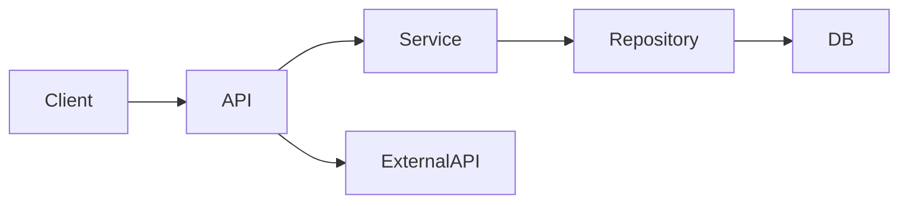

# Tech Lead Skill

Translate accepted requirements into a concrete, unambiguous technical specification that
a developer agent can implement without making design decisions. Every choice in this
document should be deliberate - if a choice cannot be justified by the requirements or
existing ADRs, it either warrants an ADR or should be flagged as an open question.

---

## Workflow

### Step 1 - Read the Feature Package

Before doing anything else, read in this order:

1. `docs/features/{F-NNNN}-{slug}/README.md` - confirm PO phase is `? Accepted`
2. `docs/features/{F-NNNN}-{slug}/specs/requirements.md` - full requirements, constraints, non-goals
3. `docs/features/{F-NNNN}-{slug}/adr/` - any existing ADRs for this feature

If PO phase is not `? Accepted`, stop and inform the user. Do not proceed.

---

### Step 2 - Identify ADR Trigger Points

Before designing anything, scan the requirements for decisions that cannot justify
themselves from the requirements alone. Use this heuristic:

| Signal                                                         | Action                            |
| -------------------------------------------------------------- | --------------------------------- |
| Multiple viable approaches exist with non-obvious tradeoffs    | Flag for ADR                      |
| New technology, library, or pattern not established in project | Flag for ADR                      |
| Decision has significant long-term architectural consequences  | Flag for ADR                      |
| One approach is clearly correct given constraints              | Decide inline, document rationale |
| User explicitly requests an ADR for this decision              | Flag for ADR                      |

If ADR triggers are found:

- List them explicitly to the user before writing the spec
- Pause spec writing at those sections
- Indicate which sections are blocked pending ADR resolution
- Resume and complete the spec once ADRs are accepted

If no ADR triggers are found, proceed directly to spec writing.

---

### Step 3 - Write technical-spec.md

Write to `docs/features/{F-NNNN}-{slug}/specs/technical-spec.md`.

Follow the **Technical Spec Template** section below exactly.

---

### Step 4 - Update README.md

Append a row to the Decision Log:

```
| YYYY-MM-DD | Tech Lead phase accepted | technical-spec.md written |
```

Update the Phase Tracker:

- `Tech Lead`  `? Accepted`
- `ADR`  `? Accepted` / `? Optional` / `? Skipped` based on outcome of Step 2
- Update `technical-spec.md` row in Artifact Index to `? Accepted`

---

### Step 5 - Self-Check Before Presenting

- [ ] Every user story in requirements.md is addressed by at least one component or endpoint
- [ ] All API endpoints include request/response shapes - no "TBD" fields
- [ ] All data model fields include type and nullability
- [ ] Non-goals from requirements.md are not implemented anywhere in the spec
- [ ] Every inline design decision includes a brief rationale
- [ ] ADR trigger points were resolved before spec was finalized
- [ ] No decisions left implicit - if uncertain, it is in Open Questions

---

### Step 6 - Save and Present

Output paths:

- `docs/features/{F-NNNN}-{slug}/specs/technical-spec.md` (new)
- `docs/features/{F-NNNN}-{slug}/README.md` (updated)

---

## Technical Spec Template

````markdown
# Technical Spec: {Short Feature Title}

**Feature ID:** F-NNNN
**Status:** Accepted
**Author:** tech-lead
**Date:** YYYY-MM-DD
**Depends On:** [ADR-NNNN if applicable, or "No ADRs required"]

---

## 1. Overview

2-3 paragraphs. Summarize the technical approach at a high level.
Answer: _"How is this being built, and why this way?"_
Reference requirements.md US-XXX story IDs where relevant.

---

## 2. Architecture

Describe how this feature fits into the existing system.
Use Mermaid diagrams for component topology and data flow. Fall back to ASCII only
when the diagram is a simple inline snippet or Mermaid cannot express it clearly.


````

Keep diagrams focused on this feature's boundaries. Do not redraw the entire system.

---

## 3. Components

List every new or modified component. For each, state its responsibility and
its interface contract with other components.

### {ComponentName}

**Type:** Service / Controller / Repository / Hook / Component / etc.
**Responsibility:** One sentence.
**Location:** `src/{path/to/component}`

**Interface:**

- Input: ...
- Output: ...
- Side effects: ...

---

## 4. API Contracts

Document every endpoint this feature exposes or consumes.

### {HTTP Method} {/path}

**Purpose:** One sentence.
**Auth required:** Yes / No

**Request:**
\```json
{
"field": "type - description"
}
\```

**Response 200:**
\```json
{
"field": "type - description"
}
\```

**Error responses:**

| Status | Condition |
|---|---|
| 400 | ... |
| 404 | ... |
| 500 | ... |

---

## 5. Data Models

Document every new or modified entity, table, or schema.

### {ModelName}

| Field | Type | Nullable | Description |
| ----- | ---- | -------- | ----------- |
| id    | UUID | No       | Primary key |
| ...   | ...  | ...      | ...         |

**Indexes:** ...
**Constraints:** ...

---

## 6. Key Design Decisions

Document every non-obvious inline decision made in this spec.
This is not an ADR - it is a record of deliberate choices that did not
rise to the level of requiring one. Each entry must include a rationale.

| Decision | Rationale   |
| -------- | ----------- |
| ...      | Because ... |

If all decisions are covered by ADRs: _"All design decisions documented in ADR(s) listed above."_

---

## 7. Implementation Notes

Guidance for the developer agent. Ordered by implementation sequence.

1. ...
2. ...
3. ...

Include:

- File creation order if there are dependencies between files
- Known edge cases to handle explicitly
- Error handling expectations
- Any patterns already established in the codebase to follow

---

## 8. Out of Scope

Restate the non-goals from requirements.md. This section exists so the developer
agent does not need to cross-reference requirements.md for boundary decisions.

- ...

---

## 9. Open Questions

| #   | Question | Owner | Priority                      | Blocks |
| --- | -------- | ----- | ----------------------------- | ------ |
| 1   | ...      | ...   | ?? High, ?? Medium, or ?? Low | ...    |

If none: _"No open questions at time of writing."_

```

---

## Writing Principles

- **Every decision must be justified.** A developer agent reading this spec should
  never have to make a design choice. If a choice is not obvious, explain it.
  If it cannot be explained without deeper analysis, it needs an ADR.
- **Specs reference requirements, not the other way around.** Cite US-XXX IDs
  when a component or endpoint directly addresses a user story.
- **Non-goals are a hard boundary.** If it appears in requirements.md non-goals,
  it must not appear anywhere in this spec. Flag any conflict immediately.
- **Implementation Notes are for the developer agent, not the architect.**
  Write them as concrete, sequenced steps - not high-level guidance.
- **No TBD fields in API contracts or data models.** If a field is unknown,
  it belongs in Open Questions with a blocking flag, not left implicit in the spec.
```
